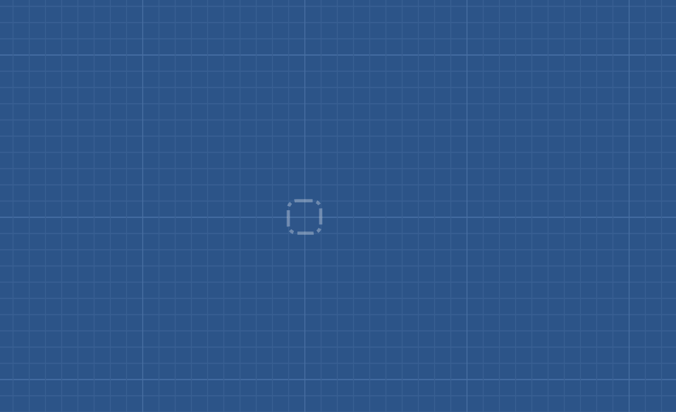

# `@tivins/bp` - Canvas Blueprint

Awesome blueprints and components for the web.

Repository: https://github.com/tivins/bp
<br>Package: https://www.npmjs.com/package/@tivins/bp



## Install

```shell
npm i @tivins/bp --save-dev
# or
git clone https://github.com/tivins/bp
```

## Main Goal

## Components

The main component `CanvasBP`, inherits of basic components that can be used is any way.

`CanvasBP` extends `CanvasMap` extends `Canvas` includes `HTMLCanvasElement`.

A `CanvasBP` require a `Blueprint` instance.

## Examples

First, run `http`

```shell
npm run build # or npm run dev
npm run http
```

Then, access to:

* A simple example of how to use `CanvasMap`:
  <br>http://localhost:8080/examples/CanvasMapExample.html
